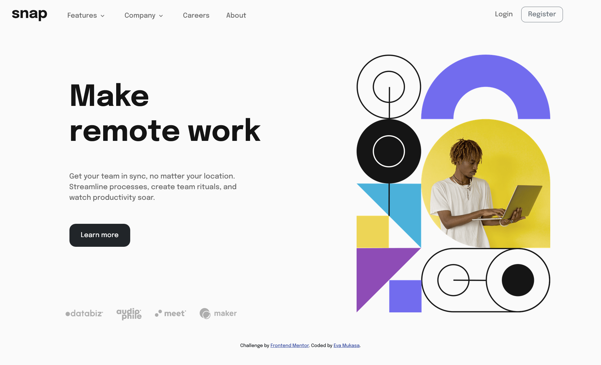
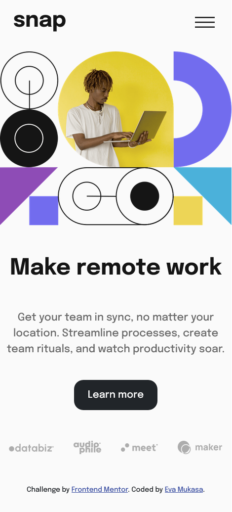

# Frontend Mentor - Intro section with dropdown navigation solution

This is a solution to the [Intro section with dropdown navigation challenge on Frontend Mentor](https://www.frontendmentor.io/challenges/intro-section-with-dropdown-navigation-ryaPetHE5). Frontend Mentor challenges help you improve your coding skills by building realistic projects. 

## Table of contents

- [Overview](#overview)
  - [The challenge](#the-challenge)
  - [Screenshot](#screenshot)
  - [Links](#links)
- [My process](#my-process)
  - [Built with](#built-with)
  - [What I learned](#what-i-learned)
  - [Continued development](#continued-development)
  - [Useful resources](#useful-resources)
- [Author](#author)
- [Acknowledgments](#acknowledgments)


## Overview

### The challenge

Users should be able to:

- View the relevant dropdown menus on desktop and mobile when interacting with the navigation links
- View the optimal layout for the content depending on their device's screen size
- See hover states for all interactive elements on the page

### Screenshot




### Links

- Solution URL: [Solution](https://www.frontendmentor.io/solutions/introsectionwithdropdownnavigationchallenge-yu0Wh8Ql1D)
- Live Site URL: [ intro-section-with-dropdown-navigation-challenge](https://intro-section-with-dropdown-navigation-challenge.vercel.app/)

## My process
I first downloaded the starter file from the Frontend Mentor website. Then, I initialized the project with Bootstrap. After that, I started ordering the HTML markup according to the order of each element. Then, I went back and forth between my stylesheet and index.html, styling the page as requested.

### Built with

- Semantic HTML5 markup
- CSS custom properties
- Flexbox
- CSS Grid
- Mobile-first workflow
- Javascript native
- [Boostrap v 5.2](https://getbootstrap.com/docs/5.2/getting-started/introduction/) - For styles

### What I learned

I'm proud of the submenu pop-up. This is the first time I've been able to make it from scratch, although I was helped a little bit by ChatGPT. But I guess this time I finally understand how it works.

Please find the code snippets below:

```html
<li class="mt-5 mt-lg-0 "><a href="" class="navlink">Features</a><span class="mx-2 menuArrow"></span>
        <ul class="p-2 position-relative d-none navSubMenu">
          <li><a href=""><span class="mr-2"></span> Todo List</a></li>
          <li><a href=""><span class="mr-2"></span> Calendar</a></li>
          <li><a href=""><span class="mr-2"></span> Reminder</a></li>
          <li><a href=""><span class="mr-2"></span> Panning</a></li>
        </ul>
      </li>
```
```css
.navSubMenu{
            position: relative;
        }
        @media(min-width: 992px){
            .navSubMenu{
                display: block;
                position: absolute;
                top: 100%;
                left: 0;
                z-index: 999;
                background-color: #fff;
                padding: 0;
                margin: 0;
                box-shadow: 0 2px 5px rgba(0, 0, 0, 0.2);
                width: fit-content;
                padding: 20px;
                border-radius: 10px;
                li{
                    padding: 4px 5px;
                }
                li:last-child{
                    position: relative;
                    left:0;
                    
                }
                
            }

        } 
```
```js
const arrowsDown=document.querySelectorAll('.menuArrow');  
      arrowsDown.forEach((arrowDown)=>{
        arrowDown.addEventListener('click',()=>{
          const arrowDownImg=arrowDown.querySelector('img');
          const currentArrowSrc=arrowDownImg.getAttribute('src');
          const newArrowDownSrc=currentArrowSrc === 'images/icon-arrow-down.svg'?'images/icon-arrow-up.svg' :'images/icon-arrow-down.svg';
         toggleAttribute(arrowDownImg,'src',currentArrowSrc,newArrowDownSrc);
         arrowDown.nextElementSibling.classList.toggle('d-none');
         arrowDown.previousSibling.classList.toggle('active');
         arrowDown.classList.toggle('active');
      })
      }) 
```

### Continued development

In the next mission, I will be more focused on managing my time effectively. It took me too long to complete this project, which I believe was primarily due to a lack of practice.

### Useful resources

- [creez-des-sites-web-responsives-avec-bootstrap-5](https://openclassrooms.com/fr/courses/7542506-creez-des-sites-web-responsives-avec-bootstrap-5) - This helped me for learning and get strated with bootstrap .
- [chatGPT](https://chat.openai.com/) - This is an amazing AI that helped me recall some CSS properties .

## Author
- Frontend Mentor - [@evelynmukasa](https://www.frontendmentor.io/profile/evelynmukasa)
## Acknowledgments

Thanks chatGPT.


